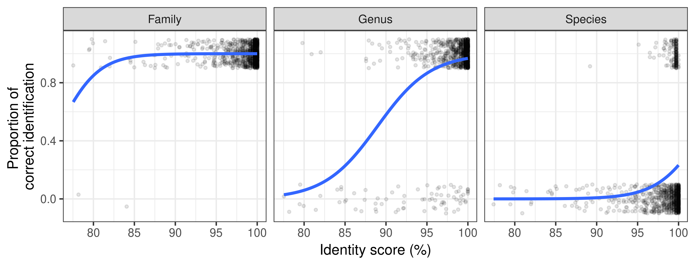
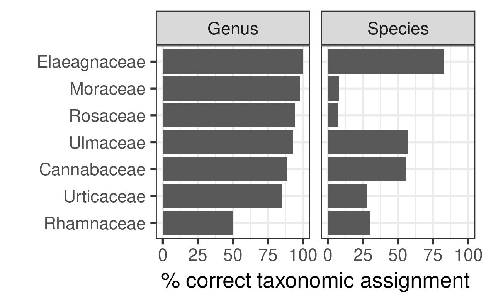

<!-- README.md is generated from README.Rmd. Please edit that file -->

```{r, include = FALSE}
knitr::opts_chunk$set(
  collapse = TRUE,
  comment = "#>",
  fig.path = "man/figures/README-",
  out.width = "100%"
)
options(tibble.print_min = 5, tibble.print_max = 5)
```

# CVrefDB R package

## Overview

**Cross Validation (CV) of DNA barcodes reference databases (refDB) using blast.**

The main aim of this package is to repeatedly blast sequences of a DNA barcode reference database against itself to evaluate the quality of the taxonomic assignments at various taxonomic levels and using different strategies. The package provides also some tools to build the seuqences reference database and some guidance to clean it up. 

**There are two main functions :** 

* `CV_blastn()` : This function will repeatedly extract a random sample of sequences from a DNA barcode reference database in fasta format, then blast these query sequences against the remainder of the database (k-fold cross-validation) or the whole database (leaked cross-validation) and return the output of the top blast hits with the true and predicted taxonomies and blastn statistics (bit score, identity,...).
* `assign_taxonomy()` : This function will assign a taxonomy to sequences based on their top blastn hits 
with various possible approaches. The output contains a taxonomic assignment for each taxonomic rank (species, genus, family,...) and identity and consensus scores that can be used to decide to dismiss unreliable assignments.

The [introduction vignette](https://raw.githubusercontent.com/GillesSanMartin/CVrefDB/master/vignettes/CVrefDB.pdf) provides a simple example on how these functions interact with a few smaller functions useful to exploit and visualize the outputs.

**Examples of output :** 

The following graph shows how the % of correct identification changes with the % of sequence identity provided by BLAST. This can help you decide on thresholds under which the identifications should not be trusted.  
Here, the species level identification are always bad even with 100% identity while the genus level identification are very good down to ~ 97% of identity. The family level identification are always very good.

<p align="center">

</p>

We can compute the % of correct identification for different taxa and at different taxonomic rank. 
This can help to spot some groups of species for which the identification is less reliable. 
Here for example the identifications of sequences of the family Moraceae and Rosaceae are rather good at genus level but very bad at species level.

<p align="center">

</p>

## Installation

**1. Install blast**

`blastn` must be installed locally on your machine through you favorite package manager or by downloading installers from [the NCBI website](https://blast.ncbi.nlm.nih.gov/Blast.cgi?PAGE_TYPE=BlastDocs&DOC_TYPE=Download).   
Under Windows you need to install for example the latest win64.exe file available on the [download page](https://ftp.ncbi.nlm.nih.gov/blast/executables/blast+/LATEST/).   
Under debian based GNU/Linux you can for example use `sudo apt install ncbi-blast+`.

To check that the installation works fine and that blast is visible from R you can type the folowing command in the R console : `system("blastn -version")` which should print your `blatn` version (and no error message).


**2. Install `Biostrings` from (Bioconductor)**

This package is used to read/write fasta files. It is not on CRAN but on another package repository dedicated to bioinformatics and its installation is slightly different than CRAN packages :

```
if (!require("BiocManager", quietly = TRUE))
    install.packages("BiocManager")

BiocManager::install("Biostrings")
```

**3. Install `CVrefDB`**

This package is a companion to a publication and is not intended to be published on the CRAN.

To install the latest version form github : 

```
if (!require("devtools", quietly = TRUE))
    install.packages("devtools")

devtools::install_github("GillesSanMartin/CVrefDB")
```


To install it from a bundled `tar.gz` file in the R console : 

```
# install first dependencies from CRAN
install.packages(c("data.tables", "dplyr", "tidyr", "ggplot2"))
# then install from source
install.packages("/<insert your path here>/CVrefDB_0.0.1.tar.gz", 
                 type = "source", repos = NULL)
```


## Usage

Look at the [pdf vignette](https://raw.githubusercontent.com/GillesSanMartin/CVrefDB/master/vignettes/CVrefDB.pdf) for more details, graphs, ...

Type `help(package = "CVrefDB")` in the R console to get the package help index.
Detailed examples are provided for each function.


```{r, eval = FALSE, echo = TRUE}
library(CVrefDB)
library(Biostrings) # from Bioconductor

# Change printing options for tibbles
options(tibble.print_max = 100, tibble.print_min = 30, tibble.width = Inf)

# path to example files from the package
fasta_path <- system.file("extdata/ITS2_Rosales_Restricted.fasta",
                          package = "CVrefDB")
taxonomy_path <- system.file("extdata/ITS2_Rosales_Restricted.tsv",
                             package = "CVrefDB")

# Read the fasta and tsv files
fasta <- Biostrings::readDNAStringSet(fasta_path)
reftaxo <- read.table(taxonomy_path, sep = "\t", header = TRUE)

# inspect the content of these files :
fasta
head(reftaxo)

# 10 fold cross validation
output_10FoldCV <- CV_blastn(fasta_db = fasta, taxo = reftaxo, seed = 12, verbose = TRUE)
head(output_10FoldCV)

# assign taxonomy
assigned_long <- assign_taxonomy(output_10FoldCV, taxo = reftaxo,  Order = NA )
head(assigned_long)

# Reorganize the output in wide format
assigned_wide <- pivot_assign_taxonomy(assigned_long)
head(assigned_wide)

# compute the % of correct assignments for each family, at family, genus and species level
scores <- 
score_per_taxon(assigned_long[assigned_long$Method == "TopHitPlus",], 
                 grouping_tax_level = "Family", 
                 predicted_NA_wrong = TRUE)
scores[order(scores$Tax_level, -scores$Pct),] 


# graph showing the relationship between the % if identity and the % of correct
# identification
assigned_long %>% 
    mutate(CorrectID = Taxon == Taxon_true & !is.na(Taxon)) %>% 
    filter(Method == "TopHitPlus") %>% 
    ggplot(aes(y = as.numeric(CorrectID), x = Ident)) +
    facet_wrap(~Tax_level, nrow = 1) +
    geom_point(alpha = 0.1, size = 0.75,
               position = position_jitter(width = 0, height = 0.1)) +
    stat_smooth(method = "glm", se = FALSE,  method.args = list(family = binomial))+
    ylab("Proportion of \ncorrect identification") +
    xlab("Identity score (%)") +
    theme_bw(10)

# NB : for large databases, it is possible to run a test only on a subset of the 
# folds (here only folds 1,3 and 5) or a subset of sequences (here first 10 
# sequences of each fold)
test <- CV_blastn(fasta_db = fasta, taxo = reftaxo, folds_subset = c(1,3,5))
test <- CV_blastn(fasta_db = fasta, taxo = reftaxo, sequences_subset = 1:10)

```


Short example on how to build you own reference database of barcode sequences
and format the taxonomy to feed the Cross Validation functions.

```{r, eval = FALSE, echo = TRUE}

# You can easily build a reference database of sequences by downloading form NCBI
genbank_download("Pulicidae[Organism] and (COI[Title] OR CO1[Tilte])")
fasta <- Biostrings::readDNAStringSet("sequences.fasta")
taxo <- read.table("taxonomy.tsv", sep = "\t", header = TRUE)

# dereplicate : remove duplicated sequences associated with the same species
# NB : we should also ideally remove poor quality sequences (long homopolymers, ...)
index_duplicated <- which(duplicated(paste(fasta, clean_species_name(taxo$name))))
fasta <- fasta[-index_duplicated]
taxo <- taxo[-index_duplicated,]

# format the taxonomy file with the structure expected by CVrefDB
lineage <- paste0("k__", taxo$kingdom, 
                  "; p__", taxo$phylum, 
                  "; c__", taxo$class, 
                  "; o__", taxo$order, 
                  "; f__", taxo$family, 
                  "; g__", taxo$genus, 
                  "; s__", gsub("^.* ", "", clean_species_name(taxo$name)) 
                  )
reftaxo <- data.frame(Accession = taxo$accession, 
                   Taxonomy = lineage)
test <- CV_blastn(fasta_db = fasta, taxo = reftaxo)

```


